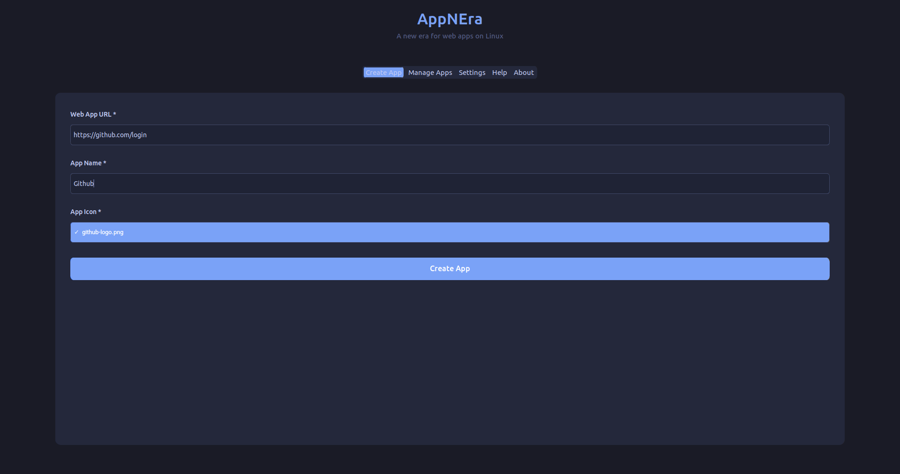
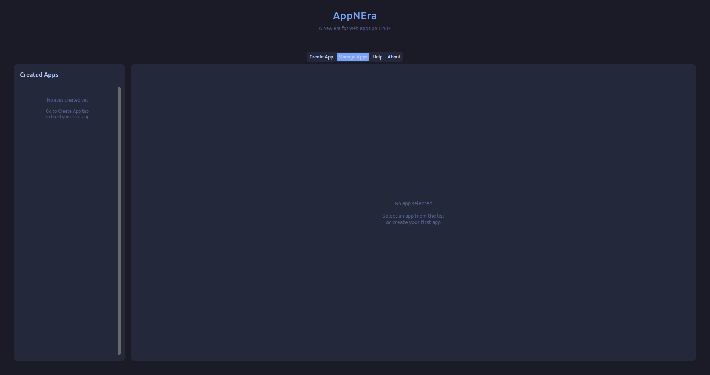
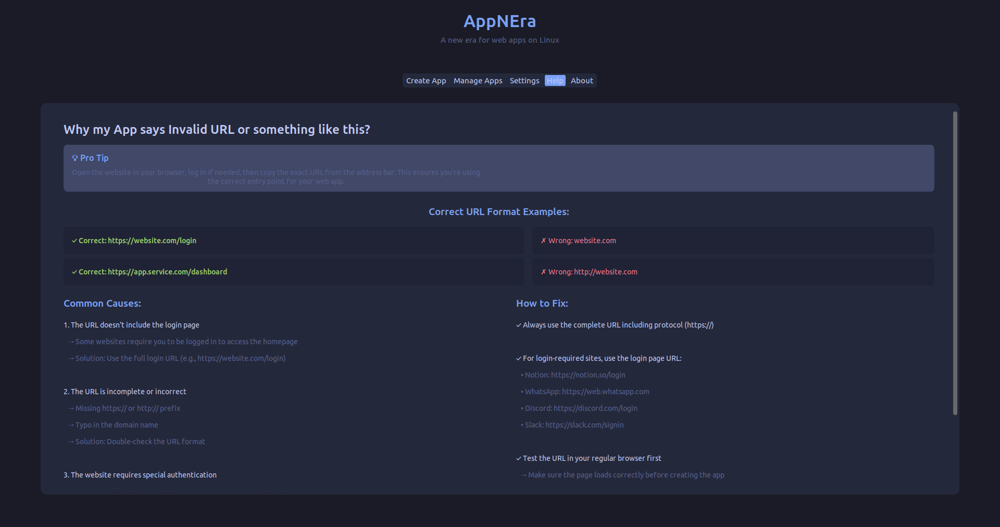
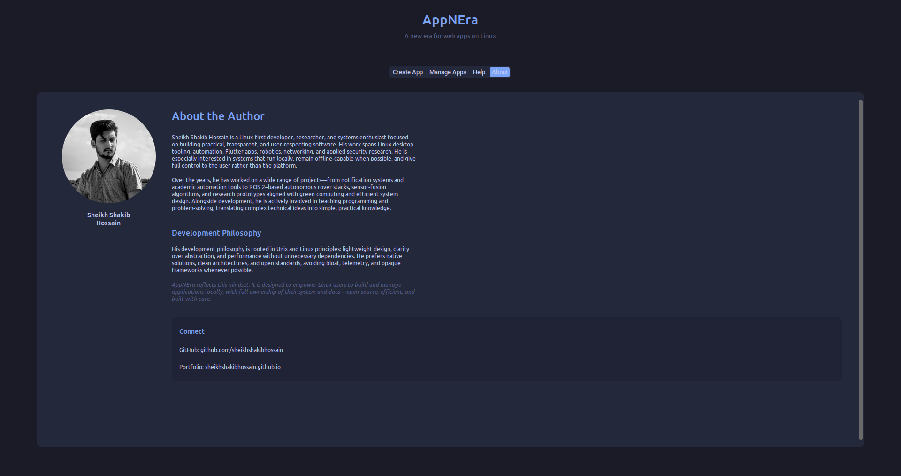

# AppNEra

**Tired of missing apps on Linux?**
**Concerned about installing random web wrappers from unknown sources?**
**Frustrated by Electron apps eating your RAM?**

AppNEra brings a **new era for web apps on Linux**.

It lets you turn any trusted web application into a **lightweight, native-like Linux app** — built **locally**, owned by **you**, and free from Electron, Chromium bundles, and untrusted third-party wrappers.

No bloat.
No telemetry.
No middlemen.

---

## 📸 Screenshots

  
  

  
  

---

## ✨ Why AppNEra?

Many Linux “apps” for popular services are unofficial web wrappers created by unknown maintainers. They often ship full Chromium engines, consume excessive resources, and introduce real security risks.

**AppNEra flips that model.**

With AppNEra:

- You build the app yourself
- Everything runs locally in your home directory
- Login sessions persist securely per app
- Resource usage stays minimal
- Nothing executes unless you created it

If you trust the website, you can safely turn it into a desktop app.

---

## 🪶 Lightweight by Design

- Uses a **native system webview** instead of Electron
- Starts fast and runs lean
- Feels like a real desktop application

Perfect for low-resource systems and long-running apps.

---

## 🔐 Security First

- No third-party binaries
- No injected JavaScript
- No background telemetry
- Isolated storage per app
- Runs entirely as your user

You stay in control of what runs on your machine.

---

## 🚀 How to Use AppNEra

AppNEra is a simple graphical tool.

1. Launch **AppNEra**
2. Enter:
   - Web app URL
   - App name
   - App icon (optional)
3. Click **Create App**

AppNEra will automatically:

- Create a local app directory
- Set up an isolated Python virtual environment
- Build a lightweight webview-based app
- Enable login session persistence
- Generate a `.desktop` entry

The app will appear in your application menu like any native Linux program.

---

## 🧹 Managing & Uninstalling Apps

AppNEra includes a **built-in uninstall section**.

- All apps created with AppNEra are automatically listed
- Select any app to view its details
- Click **Uninstall** to remove it completely

Uninstalling an app will:

- Remove the app directory
- Delete its virtual environment
- Remove its `.desktop` entry
- Clear all app-specific data

No leftovers.
No manual cleanup.

---

## 📂 App Storage

All apps created by AppNEra live entirely in your home directory:

AppNEra never modifies system directories or global files.

---

## 🧩 Ideal Use Cases

- Chat apps (Discord, Slack, Teams)
- Productivity tools (Notion, Trello, Jira)
- AI tools and dashboards
- Music and streaming services
- Any trusted web application you use daily

---

## 🐧 Built for Linux Users

AppNEra follows Linux principles:

- User ownership
- Transparency
- Minimalism
- No lock-in

No app stores.
No forced updates.
No unnecessary dependencies.

---

## 🛠 Requirements

- Python 3.9 or newer
- A supported system webview backend

All dependencies are handled automatically by AppNEra.

---

## 🌱 The Vision

AppNEra is not just another wrapper.

It represents a shift:
from installing random third-party wrappers
to **building exactly what you need — locally, securely, and cleanly**.

---

## 📜 License

Open source.
Transparent.
User-first.

---

**AppNEra — A new era for web apps on Linux.**
